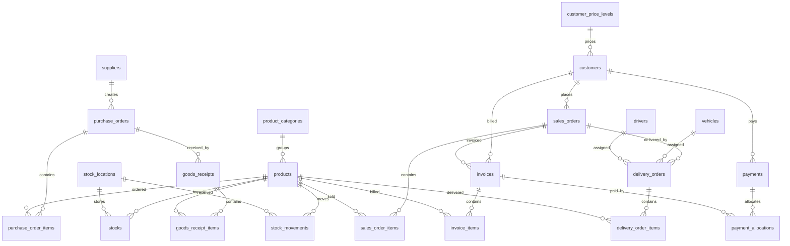

# ERD ERP Besi

Dokumen ini menjelaskan rancangan database PostgreSQL untuk starter ERP distributor besi. Semua akses database dilakukan lewat backend Express API dan Prisma.

## Relasi Utama

- `suppliers` memiliki banyak `purchase_orders`.
- `customers` memiliki banyak `sales_orders`, `invoices`, `payments`, dan `delivery_orders`.
- `customer_price_levels` dipakai customer untuk harga bertingkat B2B/B2C.
- `product_categories` memiliki banyak `products`.
- `products` terhubung ke stok, movement stok, item PO, item penerimaan, item SO, item invoice, dan item delivery.
- `stock_locations` menyimpan posisi stok; kombinasi `product_id` dan `location_id` unik di `stocks`.
- `purchase_orders` memiliki banyak `purchase_order_items` dan `goods_receipts`.
- `goods_receipts` mencatat penerimaan barang dan menjadi sumber movement stok masuk.
- `sales_orders` memiliki banyak `sales_order_items`, `invoices`, dan `delivery_orders`.
- `invoices` mencatat piutang customer, sedangkan `payments` dialokasikan ke invoice melalui `payment_allocations`.
- `delivery_orders` memakai `vehicles` dan `drivers`, lalu detail barang dikirim dicatat di `delivery_order_items`.
- `audit_logs` siap mencatat perubahan penting, terutama stock movement dan dokumen transaksi.

## Diagram Mermaid

## Alur Stok Masuk

1. User membuat `purchase_orders` dan `purchase_order_items`.
2. Saat barang datang, user membuat `goods_receipts` dan `goods_receipt_items`.
3. Sistem menambah atau membuat baris `stocks` berdasarkan `product_id` dan `location_id`.
4. Sistem membuat `stock_movements` dengan `movement_type = IN`, `reference_type = GOODS_RECEIPT`, dan `reference_id` ke goods receipt.
5. Status PO bergerak dari `ORDERED` ke `PARTIAL_RECEIVED` atau `RECEIVED`.

## Alur Stok Keluar

1. User membuat `sales_orders` dan `sales_order_items`.
2. Saat order siap dikirim, user membuat `delivery_orders` dan `delivery_order_items`.
3. Ketika delivery dikonfirmasi, sistem mengurangi `stocks`.
4. Sistem membuat `stock_movements` dengan `movement_type = OUT`, `reference_type = DELIVERY_ORDER`, dan `reference_id` ke delivery order.
5. Status SO bergerak dari `CONFIRMED` ke `PARTIAL_DELIVERED` atau `DELIVERED`.

## Alur Piutang

1. Invoice dibuat dari `sales_orders`.
2. `due_date` dihitung dari `invoice_date` dan `payment_term_days`.
3. Invoice dimulai dari status `UNPAID`.
4. Saat customer membayar, sistem membuat `payments`.
5. Pembayaran dialokasikan ke invoice melalui `payment_allocations`.
6. `paid_amount` dan status invoice berubah menjadi `PARTIAL`, `PAID`, atau `OVERDUE` berdasarkan nominal dan due date.
